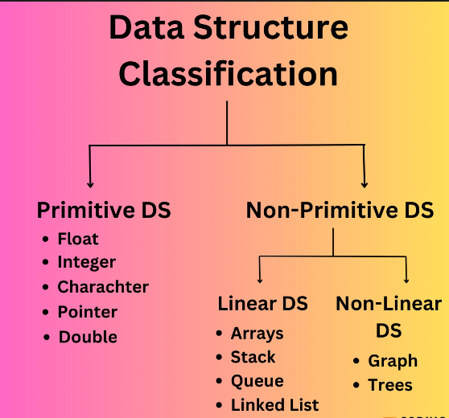

- Datas are simply values or set of values

- A **data item** refers to a single unit of values

- Data items that are divided into sub items are called **Group items**

- **An entity** is something that has certain attributes or properties which may be assigned values. That may be either numeric or non-numeric.

&nbsp;

&nbsp;

# Definition of DS

Data Structure is a branch of computer science which allows to understand the **organization of data** and the** management of the data flow** to increase any program's efficiency.

&nbsp;

A data structure is not only used for organizing the data. It is also used for processing, retrieving, and storing dataA data structure is not only used for organizing the data. It is also used for **processing**, **retrieving**, and **storing** data.

&nbsp;

&nbsp;

# Need Of Data structure:

- Data structure modification is easy.
- It requires less time.
- Save storage memory space.
- Data representation is easy.
- Easy access to the large database

&nbsp;

&nbsp;

# Classification of Data Structures

The Data Structure can be classified into **two** categories:

&nbsp;

## Primitive Data Structure

These are the fundamental data structures that can be operated directly on data and machine instructions.

These data structures are defined by programming language or we can say it is built-in. The notations of these data structures vary from machine to machine.

&nbsp;

Examples of primitive data structure:

- Float
- Integer
- Character
- Pointer
- Double

&nbsp;

## Non-Primitive Data Structure

These data structures are derived from the primitive data structure. Their declaration depends entirely upon the programming languages.

The non-primitive data structure emphasizes the structural grouping of homogenous or heterogeneous data items.

&nbsp;

&nbsp;

## Linear Data Structures

A data structure is said to be linear if it's elements form **a sequence** or **a linear list**.

Every element in the linear data structure is attached to its previous and next adjacent elements.

In Linear DS, Elements are arranged in one dimension.

&nbsp;

&nbsp;

# Non-Linear Data Structure

A data structure is said to be non-linear if it's elements are not arranged in sequence.

Elements are arranged in one-many, many-one and many-many dimensions.
