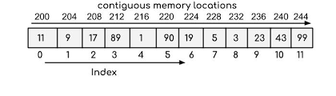

# Overview

- [Overview](#overview)
- [Memory representation of Array](#memory-representation-of-array)
- [Declaration of Array](#declaration-of-array)
  - [Array declaration by specifying size](#array-declaration-by-specifying-size)
  - [Array declaration by initializing elements](#array-declaration-by-initializing-elements)
- [Note](#note)

&nbsp;

&nbsp;

&nbsp;

# Memory representation of Array

In an array, all the elements are stored in contiguous memory locations. So, if we initialize an array



&nbsp;

&nbsp;

# Declaration of Array

Arrays can be declared in various ways in different languages.

In CPP

- This array will store **_integer_**,**_float_** and **_char_** type element respectively

  ```cpp
  int arr[5];
  float arr[20];
  char arr[10];
  ```

&nbsp;

In JavaScript

```js
let arr = [];
```

&nbsp;

&nbsp;

## Array declaration by specifying size

```cpp
int a[10];
```

Or

```cpp
int n=10;
int arr[10];
```

&nbsp;

## Array declaration by initializing elements

```cpp
int arr[4] = {10,20,30,40}
```

or

```cpp
int arr[] = {10,20,30,40}
```

&nbsp;

# Note

```cpp
// These are same

int a[3]= {};
int a[3] = {0};
int a[3] = {0,0,0};
```

```cpp
// The both are same

int a[3] = {1};
int a[3] = {1,0,0};
```

```cpp
// The both are same

int a[] = {[0,1] = 3};
int a[2] = {3,3};
```

```cpp
// The both are same
int a[3] = {[0,1] = 3};
int a[3] = {3,3,0};
```

```cpp
// These are same

int *a;
int* a;
int*a;
int * a;
```
